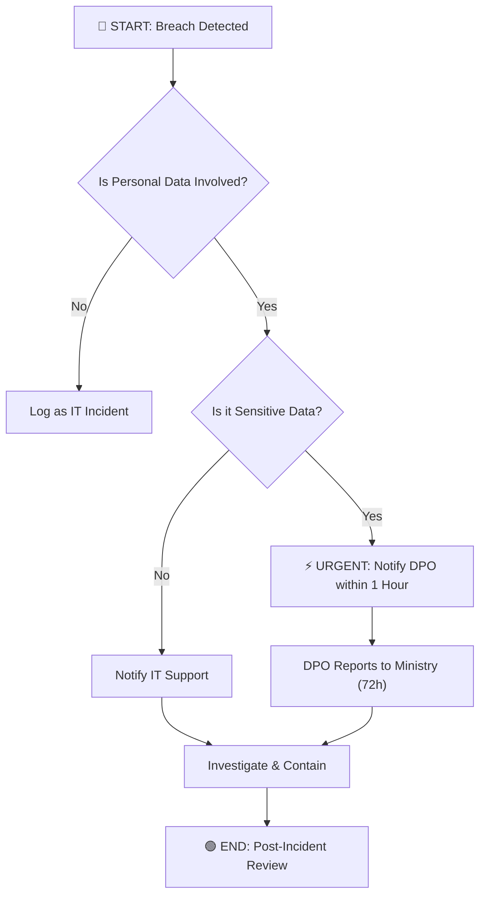

# Incident Response Playbook

Follow this workflow immediately if you suspect a data breach.

## Response Workflow

```mermaid
graph TD
    A["🔴 START: Breach Detected"] --> B{"Is Personal Data Involved?"}
    B -- No --> C["Log as IT Incident"]
    B -- Yes --> D{"Is it Sensitive Data?"}
    D -- Yes --> E["⚡ URGENT: Notify DPO within 1 Hour"]
    D -- No --> F["Notify IT Support"]
    E --> G["DPO Reports to Ministry (72h)"]
    F --> H["Investigate & Contain"]
    G --> H
    H --> I["🟢 END: Post-Incident Review"]
```